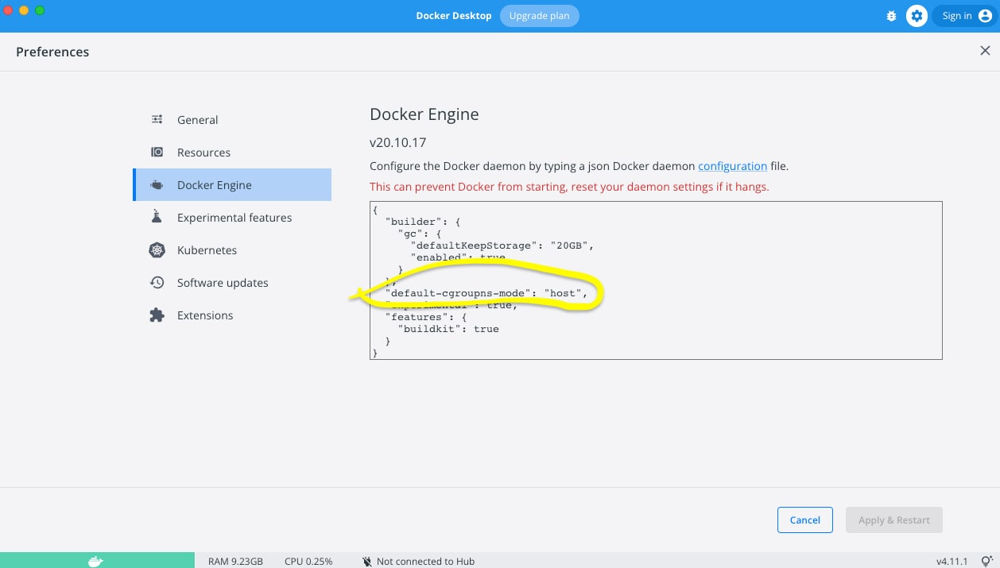

# ArenaData QuickMarts installation scripts

## ADCM and Nodes (re)Deployment Scripts

### Docker-compose (docker-deploy.sh)

#### Description

Script name: docker-deploy.sh Steps performed by the script:

- stop containers, 
- remove ADCM (ArenaData Cluster Manager) image and settings
- build required images
- start containers

*Note: Script returns 'exit 0' instantly after container start, it's not waiting for full ADCM start.*

#### Dependencies

- docker installed
- docker-compose installed
- privileged mode enabled for docker
- docker-compose.yml and Dockerfile in the same folder

Docker-compose specification used for ADCM and ClickHouse nodes definition. Dockerfile contains all the commands a user could call on the command line to assemble ClickHouse node image.
No user-defined environment variables required.

##### Docker privileged mode
Privileged mode required fo ClickHouse containers. Without privileged mode container SystemD services such as 'sshd' will fail to start.


Config example (OSX):
```
{
  "builder": {
    "gc": {
      "defaultKeepStorage": "20GB",
      "enabled": true
    }
  },
  "default-cgroupns-mode": "host",
  "experimental": false,
  "features": {
    "buildkit": true
  }
}
```
This specific line ```default-cgroupns-mode": "host"``` enables privileged mode.

#### Volumes

Script creates container volumes based on 'docker-compose.yml' definition.
In script itself, volumes/adcm cleaning is hard-coded. So it always removes ADCM cluster configuration.

**Important: If you want to change volume location, change both 'docker-compose.yml' and 'docker-deploy.sh'**

**Important: Script does not clean ClickHouse data volume, but you may need to clean it manually if you restart deployment scripts while *decreasing host count***


